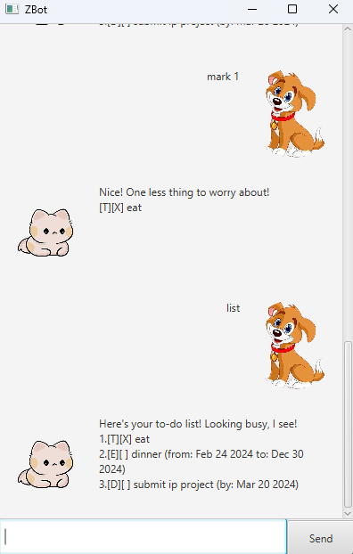

# ZBot User Guide



**ZBot** is here to help you stay organized and efficiently manage your tasks.
Whether you need to set deadlines, track events, or handle recurring tasks, 
**ZBot** is ready to assist. Just give me the command, and I’ll help you create, 
update, delete, and monitor your to-dos. Let's take control of your tasks and 
boost your productivity!

## Features

### Show existing tasks: `list`

Shows a list of all existing tasks.

Format: `list`

Example:
```
Here's your to-do list! Looking busy, I see!
1.[T][] sumit my assignment
2.[T][X] read a book
```

### Mark and Unmark tasks: `mark`, `unmark`

Marks and unmarks a task in the task list respectively.

Format: `mark/unmark <task_index>`
- Marks or unmarks the task at the specified `task_index`. The index refers to the task index shown in the displayed
  task list. 
- The index **must be a positive integer**.
- The index must also be **within** the list size.
- The task will then be marked with [x] or [ ] when displayed depending on whether is it marked or unmarked.

Examples:
- `mark 1` marks the first task in the list with a cross, displaying:
```
Nice! One less thing to worry about!
1.[T][X] read a book
```
- `unmark 1` unmarks the first task in the list by removing the cross, displaying:
```
Alright, back on the to-do list it goes!
1.[T][] read a book
```

### Search for tasks by keyword: `find`
Finds tasks whose description contains the keyword

Format:`find <keyword>`
- The search is case-sensitive. e.g`book` will not match `Book`

Example:
`find book` displays
```
Detective mode activated! Here's what I found!
1.[T][] read a book
2.[D][] submit book review (by: Dec 02 2025)
```

### Create a ToDo task: `todo`
Creates a Task with a description.
- A ToDo task starts off unmarked.

Format: `todo <description>`

Example: `todo bake a cake` 
```
Got it! Another task added to your plate!
[T][] bake a cake
You have 6 tasks in the list. Let's go!!
```
creates an unmarked ToDo task with `bake a cake` as its description.

### Create an Event task: `event`
Creates a Task with a description, a start time and an end time.
- An Event task starts off unmarked.
- `Event` expects a start time and an end time in the format of `yyyy-MM-dd`

Format: `event <description> /from <start_time> /to <end_time>`

Example: `event attend class chalet /from 2024-12-24 /to 2024-12-25` creates
```
Event locked in! Let's hope it's fun!
[E][] attend class chalete (from: Dec 24 2024 to: Dec 25 2024)
You have 7 tasks in the list. Let's go!!
```

### Create a Deadline task: `deadline`
Creates a Task with a description and a deadline.
- A Deadline task starts off unmarked.
- `DEADLINE` expects a date in the format of `yyyy-MM-dd`

Format: `deadline <description> /by <date>`

Example: `deadline submit book review /by 2025-02-21` displays:
```
Tick-tock! I've set your deadline!
[D][] submit book review (by: Feb 21 2025)
You have 8 tasks in the list. Let's go!!
```
### Delete a task: `delete`
Deletes a task at the specified index.

Format: `delete <task_index>`
- Deletes the task at the specified `task_index`. The index refers to the index number shown in the displayed
  task list. 
- The index **must be a positive integer** 1,2,3... 
- The index must also be **within** the list size.

Example: `delete 4` deletes the task at the 4th index in the list, displaying:
```
Poof! Gone like it never existed!
Task removed: [D][] submit book review (by: Feb 21 2025)
You have 7 tasks left in the list. Let's go!!
```

### Undo a command: `undo`
Undo the previous command
- This will restore your task list to its state before the last command was executed.
- This command works for all commands except `list`, `find`, `undo` and `bye` 

Format: `undo`

Example: If there were previous states, `undo` will restore task list to the state before, displaying:
```
Rewinding time... Done!
```
If there was no previous state, `undo` will do nothing, displaying:
```dtd
Oops! Something seems to be not working. Have you had any new actions added yet?
```

### Save existing tasks and exit application: `bye`
- Saves the list of tasks you currently have locally, 
which will be loaded in the next time you start the application again.
- Exits the application

Format: `bye`

### Installation
1. Ensure you have Java `17` or above installed on your computer.
2. Download the latest `.jar` file from [here](https://github.com/zhenglong1603/ip/releases/tag/A-Release).
3. Copy the file to the folder you want to use as the home folder for your Zbot chatbot.
4. Open a command terminal, `cd` into the folder you put the `.jar` file in, and use the following command to run the application:
   `java -jar zbot.jar`
